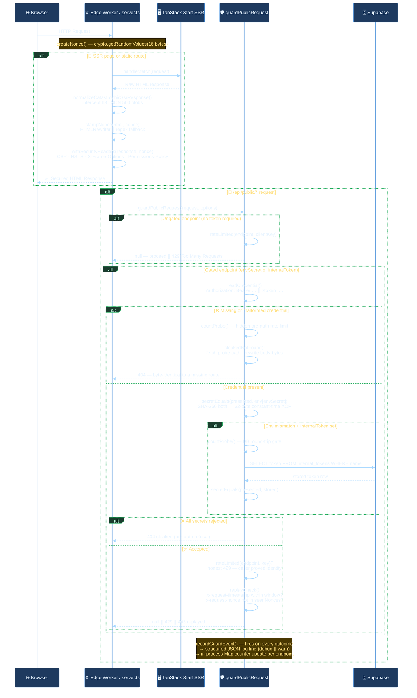
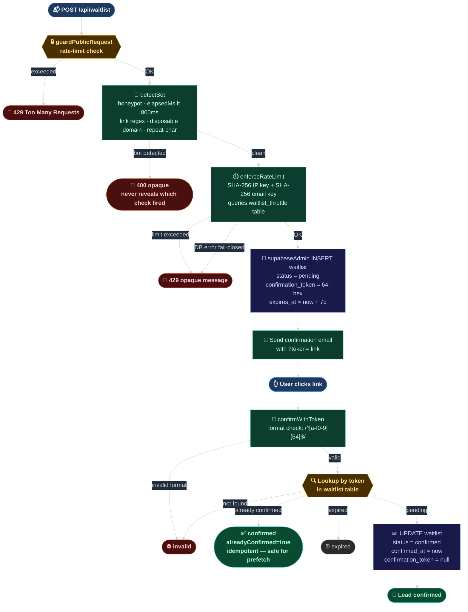

# ADR-001 — VouchList: Core Architecture Decisions

**Status:** Accepted  
**Date:** July 2026  
**Author:** Vikas Dayashankar Sahani

---

## Context

VouchList is a demand-validation landing page (Phase 0) for a planned WhatsApp-native recommendation bot. The technical requirements for Phase 0 are deliberately asymmetric: the surface area is small (waitlist form, content pages, a CSP reporting pipeline), but the security and observability requirements are full-production — because any breach or spoofed signup would invalidate the go/no-go decision being made. This document records the five architectural decisions that shaped the current `src/` codebase and the reasoning that would make them difficult to reverse without significant re-work.

---

## Decision 1 — TanStack Start for SSR over Next.js or a pure SPA

### Decision

Use **TanStack Start** (v1.168) with **TanStack Router** (v1.170) as the full-stack SSR framework, deployed as a **Cloudflare Workers-compatible edge runtime** via Vite/Bun. The compiled output is a single `fetch(request): Promise<Response>` export — no Node.js process, no HTTP server.

### The nonce problem is what drives the framework choice

A Content Security Policy with `'unsafe-inline'` provides no meaningful protection. Proper CSP requires every inline `<script>` and `<style>` to carry a cryptographically random nonce that matches the `script-src` directive in the response header — and the nonce **must change per request**, otherwise it degrades back to a static whitelist. This means HTML must be generated server-side at request time, not pre-rendered at build time.

Next.js App Router satisfies this, but ships a heavier Node.js runtime and requires a separate API-routes layer for edge-compatible server functions. TanStack Start compiles to a single `fetch(request)` handler (`src/server.ts`) the Cloudflare Worker runtime calls directly.

### How the nonce flows through the system

```
Worker receives Request
  → server.ts: createNonce()           ← 16 random bytes, base64-encoded
  → TanStack Start SSR renders HTML    ← nonce injected via __webpack_nonce__ global
  → stampNonce()                       ← every <script>/<style> without src= gets nonce=""
  → withSecurityHeaders()              ← CSP header stamped with matching nonce value
  → Response leaves the edge
```

`stampNonce()` in `security-headers.ts` handles two runtimes:

- **Cloudflare Workers**: native `HTMLRewriter` streaming transformer — nonce is stamped on the wire without buffering the full body.
- **Node.js / dev**: regex pass over the buffered HTML string as fallback.

### h3 error swallowing and the catastrophic SSR response normaliser

The `h3` framework underlying TanStack Start swallows unhandled SSR throws into a JSON 500 body `{"unhandled":true,"message":"HTTPError"}`. Without interception, this JSON blob would be served with `content-type: text/html`, which is both incorrect and exposes framework internals. `normalizeCatastrophicSsrResponse()` in `server.ts` detects this shape and substitutes a proper HTML error page before security headers are applied.

### Consequences

- `src/server.ts` is the **only** path through which all responses pass — SSR pages, API routes, and error responses all go through `withSecurityHeaders()`. There is no code path that returns a header-free page.
- Error capture is wired at the import side-effect level (`import "./lib/error-capture"`) so even `console.error` calls inside h3 internals are intercepted and expanded with stack traces before serialisation.

---

## Decision 2 — Shared `guardPublicRequest` for all `/api/public/*` routes

### Decision

Every handler under `/api/public/*` calls `guardPublicRequest()` from `src/lib/api-guard.ts` before doing any work. No handler implements its own token comparison, rate limiting, or replay protection.

### Why a shared guard

`/api/public/*` bypasses Supabase Row Level Security and site authentication by design — these are endpoints the database scheduler, browser, or server-side cron calls directly. Without a shared guard, each handler independently implements (and potentially diverges on) token checking, rate limiting, and error responses. A shared guard means the endpoints cannot drift apart, and a new endpoint gets the same protection by construction.

### The four-layer decision tree inside `guardPublicRequest`

```
1. Gated? (envSecret or internalToken provided)
   ├─ No  → rate-limit only, skip token logic
   └─ Yes → enter token flow:

       2. Credential readable? (Authorization: Bearer or ?token=)
          ├─ Missing / malformed → countProbe() → cloakedNotFound()
          └─ Present:

              3. Env secret matches?
                 secretEquals(presented, env[envSecret])   ← SHA-256 hash both, constant-time XOR
                 ├─ Yes → step 4
                 └─ No  → internalToken set?
                    ├─ Yes: countProbe() → Supabase round-trip → secretEquals again
                    └─ No  → cloakedNotFound()

              4. Authenticated:
                 rateLimited(endpoint, key)?  → honest 429
                 replayCheck()?              → honest 403
                 All pass                    → null (handler proceeds)
```

### Cloaking: pre-auth refusals look like missing routes

For gated endpoints, any failure **before the caller proves they hold the secret** returns a response byte-identical to the app's own 404 page. `cloakedNotFound()` fetches `/api/public/__does-not-exist` from the app itself on first call, caches the exact body and headers — including the router's internal null-separated path encoding — then rewrites the probe path to the actual requested path before returning. The result: a stranger probing for a protected endpoint gets the same response as a mistyped URL.

The sample is taken once per isolate lifetime (lazy singleton promise), not per request.

### Timing-safe comparison

`secretEquals(a, b)` hashes both arguments through `crypto.subtle.digest("SHA-256")` in parallel, then compares the fixed-length 32-byte digests with a constant-time XOR loop. This ensures:

- Response time does not reveal the position of the first differing character.
- Response time does not reveal the length of the expected secret (both inputs are hashed to 32 bytes).

### Rate limiting: fixed-window in-process Map

```
buckets: Map<"${endpoint}:${clientIP}", { count, resetAt }>
MAX_BUCKETS = 5,000   (hard ceiling; LRU eviction via Map insertion order)
```

Key design choices:

- **Fixed window** (not sliding): simpler, no float arithmetic. Worst-case 2× overshoot at window boundary is acceptable.
- **Probe budget separate from endpoint budget**: unauthenticated guesses count against `${endpoint}#probe` (2× the endpoint limit). A stranger cannot exhaust the endpoint budget before proving identity.
- **Fail-open for rate-limited authenticated callers**: once a caller has proved their token, they receive an honest `429`. An unauthenticated flood always sees a cloaked 404.

### Replay protection: timestamp + nonce pair

```
x-request-timestamp:  epoch ms, must be within replayWindowMs (default 5 min)
x-request-nonce:      opaque string, must not have been seen in the window
```

Both headers must be present or both absent. A half-pair is rejected as `malformed` — a nonce with no clock never expires, and a timestamp with no nonce can be replayed freely inside the window. Seen nonces are stored in a bounded `Map<nonce, expiresAt>` (5,000 max), lazily evicted by expiry.

---

## Decision 3 — CSP in enforce-by-default mode with a violation reporting pipeline

### Decision

The Content Security Policy ships in **enforce mode** by default. A full pipeline — `csp_reports` Supabase table, spike detection, cooldown deduplication, and webhook delivery — runs as a scheduled job so the policy can be tightened iteratively without going blind.

### The rollout knob

`cspMode()` reads `CSP_MODE` from the environment at request time. `CSP_MODE=report-only` switches the response header from `Content-Security-Policy` to `Content-Security-Policy-Report-Only` site-wide without a deploy — the standard pre-enforce audit cycle.

### Key policy directives

| Directive                       | Value                                   | Reason                                                                                |
| ------------------------------- | --------------------------------------- | ------------------------------------------------------------------------------------- |
| `script-src`                    | `'self' 'nonce-{nonce}'` + GA4 hosts    | No `'unsafe-inline'`; nonce gates every inline script                                 |
| `style-src`                     | `'self' 'nonce-{nonce}'` + Google Fonts | Runtime style injectors (react-remove-scroll) carry the nonce via `__webpack_nonce__` |
| `style-src-attr`                | `'unsafe-inline'`                       | `style=""` attributes cannot carry nonces; scoped to attribute context only           |
| `frame-src` / `frame-ancestors` | `'none'`                                | Prevents iframes both ways; belt-and-suspenders with `X-Frame-Options: DENY`          |
| `connect-src`                   | `'self'` + Supabase + GA4               | Restricts `fetch()` and WebSocket to known hosts                                      |
| `upgrade-insecure-requests`     | —                                       | Forces all embedded sub-resources to HTTPS                                            |

### Spike detection algorithm (`csp-alerts.server.ts`)

Violations are stored in `csp_reports`. A scheduled check (every 15 min) runs `evaluateSpikes()`:

1. Fetch last 24 h of violations (baseline), capped at 20,000 rows.
2. Partition by timestamp: **recent window** (last 15 min) vs **baseline** (remainder).
3. Expected rate per window: `baselineTotal ÷ (baseline hours × 60 ÷ window minutes)`.
4. Alert if: violation is **new** (zero baseline) **or** `windowCount ≥ max(MIN=10, expected × 4)`.
5. Severity: `critical` if `windowCount ≥ 100`, else `warning`.
6. Cooldown: skip if the same fingerprint already alerted in the last 60 min (`csp_alerts` table lookup).
7. Persist to `csp_alerts` **before** delivering — a failing webhook loses the notification, never the evidence.
8. Deliver: always log; POST to `CSP_ALERT_WEBHOOK_URL` if set (plain `{"text","severity","fingerprint"}` — Slack/Teams compatible).

---

## Decision 4 — Double opt-in waitlist with three-layer bot defence

### Decision

Waitlist signups pass through three sequential layers before any row is written: (1) structural bot detection, (2) database-backed rate limiting with SHA-256-hashed keys, (3) double opt-in with a 7-day expiring 64-hex token. The Supabase `anon` role has no `INSERT` permission on `waitlist`; all writes use the service-role key via a server function.

### Layer 1: Structural bot detection (`detectBot`)

Runs before any database round-trip. All five checks return a uniform error — the caller never learns which check fired.

| Check                                         | Signal                                             |
| --------------------------------------------- | -------------------------------------------------- |
| `website` field non-empty                     | Hidden honeypot field; only bots fill it           |
| `elapsedMs < 800 ms`                          | Too fast for a human to read and complete the form |
| Link pattern in name/community/city           | `http://`, `www.`, `[url=`, `<a `                  |
| Disposable email domain                       | Set of 10 known throwaway domains — O(1) lookup    |
| Repeated character run `≥ 8` (`/(.)\\1{7,}/`) | `aaaaaaaa` as a name                               |

### Layer 2: Database-backed rate limiting (`enforceRateLimit`)

Rate limits survive isolate restarts and scale across workers because they are enforced against a `waitlist_throttle` table, not in-process memory.

- **Bucket keys**: `SHA-256("ip:" + ip.toLowerCase())` and `SHA-256("email:" + email.toLowerCase())`, truncated to 32 hex chars. Raw IPs and emails are never stored.
- **Local address bypass**: `isLocalAddress()` exempts loopback and RFC-1918 ranges from the IP-level limit, so CI and local dev do not self-block.
- **Fail-closed**: a database error during the throttle read rejects the submission rather than allowing it through.
- **Self-cleaning**: after each insert, rows older than 48 h (the widest window) are deleted in the same transaction. No separate cron needed.

### Layer 3: Double opt-in (`mintConfirmationToken` → `confirmWithToken`)

1. Signup stores `status: "pending"` + 64-hex token + `confirmation_expires_at: now + 7 days`.
2. Confirmation email carries the token as `?token=…`.
3. On click: format validated (`/^[a-f0-9]{64}$/`), expiry checked, row updated `status → "confirmed"`, token set to null.
4. Re-clicking an already-confirmed link returns `{alreadyConfirmed: true}` — idempotent, safe for email prefetchers.

---

## Decision 5 — In-process metrics and Prometheus exposition for the API guard

### Decision

`api-guard-metrics.ts` maintains in-process counters per endpoint, readable as JSON or Prometheus text via the `guard-metrics` endpoint. No external metrics sink.

### Design constraints

- **Zero hot-path overhead**: `recordGuardEvent()` runs synchronously and never awaits; counters are plain integer increments.
- **Privacy-preserving caller identity**: raw IPs are never stored in logs or counters. Each caller is identified by an 8-hex FNV-1a digest — enough to group a single source's requests in the log without recording the address.
- **Bounded memory**: endpoint map (`MAX_ENDPOINTS = 200`), per-endpoint caller set (`MAX_CALLERS_PER_ENDPOINT = 1,000`). Eviction is LRU via `Map` insertion order.
- **Dual output**: `guardMetrics()` returns typed JSON; `guardMetricsPrometheus()` wraps it in Prometheus text format so a standard scraper can consume the counters without knowing the JSON shape.
- **Log severity split**: `allowed` → `console.debug` (filterable); all refusals → `console.warn` (always visible in worker logs).

---

## Mermaid Diagrams

### 1 — Full Request Lifecycle



### 2 — Waitlist Signup Pipeline



### 3 — CSP Violation → Alert Pipeline

```mermaid
%%{init: {"theme": "dark", "themeVariables": {"darkMode": true, "background": "#0d1117", "primaryColor": "#1e3a5f", "primaryTextColor": "#e8f4ff", "edgeLabelBackground": "#1f2d3d", "clusterBkg": "#161b22"}}}%%
flowchart LR
    classDef browser  fill:#1e3a5f,stroke:#4a90d9,color:#e8f4ff,font-weight:bold
    classDef ingest   fill:#0d3d2e,stroke:#27ae60,color:#c8ffe8
    classDef store    fill:#1a1a4a,stroke:#7f8fd4,color:#c8d8ff
    classDef schedule fill:#4a3000,stroke:#d4860f,color:#ffe082,font-weight:bold
    classDef analysis fill:#2a0a4a,stroke:#9b59b6,color:#e8c8ff
    classDef decision fill:#4a3000,stroke:#d4860f,color:#ffe082
    classDef silent   fill:#1e1e1e,stroke:#555555,color:#aaaaaa
    classDef alert    fill:#4a0f0f,stroke:#e74c3c,color:#ffc8c8,font-weight:bold
    classDef webhook  fill:#0a3a4a,stroke:#1abc9c,color:#a8ffd8,font-weight:bold

    A(["🌐 Browser CSP violation"]):::browser
    A --> B["📮 POST /api/public/csp-report\nungated — rate-limit only\n60 req/min per IP"]
    B:::ingest
    B --> C["💾 INSERT csp_reports\nfingerprint = SHA-256(directive + blocked_uri)"]
    C:::store
    C --> D(["🗄️ csp_reports table"]):::store
    D --> E{{"⏰ Scheduled cron\nevery 15 minutes"}}
    E:::schedule
    E --> F["🔬 evaluateSpikes\nfetch last 24h — cap 20 000 rows\npartition: recent 15m vs baseline"]
    F:::analysis
    F --> G{{"📊 Spike detected?\nnew violation (zero baseline)\nOR count ≥ max(10, expected × 4)"}}
    G:::decision
    G -- no spike --> I(["😴 No action"]):::silent
    G -- spike --> J{{"🕐 withoutCooldown\nsame fingerprint alerted\nin last 60 min?"}}
    J:::decision
    J -- yes, cooling down --> I
    J -- no, fresh alert --> K["📝 INSERT csp_alerts\nevidence persisted before delivery\nseverity: warning ∥ critical ≥100"]
    K:::alert
    K --> L{{"🔗 CSP_ALERT_WEBHOOK_URL set?"}}
    L:::decision
    L -- no --> M["📋 console.warn ∥ console.error\nworker log only"]:::silent
    L -- yes --> N["🚨 POST webhook\nSlack / Teams / generic sink\nbody: text + severity + fingerprint"]:::webhook
```



---

## Architectural Principles Summary

| Principle                                           | Manifestation in code                                                                              |
| --------------------------------------------------- | -------------------------------------------------------------------------------------------------- |
| **Single responsibility, enforced by construction** | `guardPublicRequest` is the only path into `/api/public/*`; no handler can bypass it               |
| **Fail closed**                                     | DB errors during rate limiting → reject; token comparison → SHA-256 digests, not string equality   |
| **No fabrication in observability**                 | Metrics are derived from live counters; Prometheus output is generated, never hand-written         |
| **Bounded memory on every hot-path data structure** | Rate limit map, nonce map, metrics map, caller sets — all have explicit maximums with LRU eviction |
| **Privacy by default**                              | No raw IPs in logs; FNV-1a digest for log correlation, SHA-256 for rate-limit bucket keys          |
| **Security headers on every response**              | `server.ts` wraps SSR pages, API routes, and error responses identically                           |
| **Rollout knobs without deploys**                   | `CSP_MODE` env var; `CSP_ALERT_WEBHOOK_URL` env var; both read at runtime                          |
